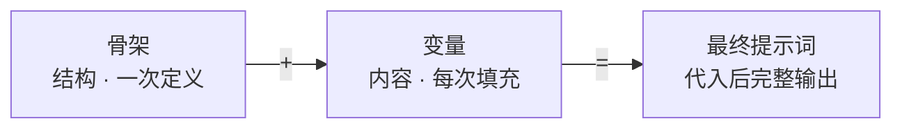
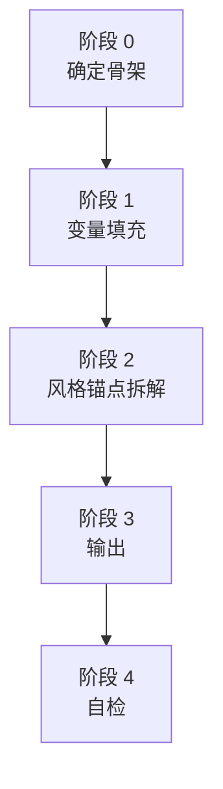
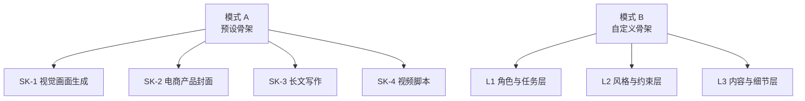
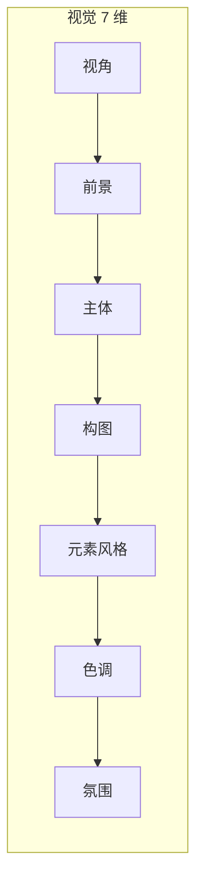
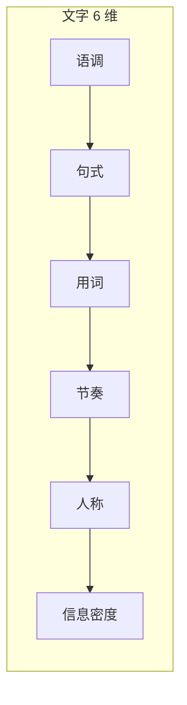
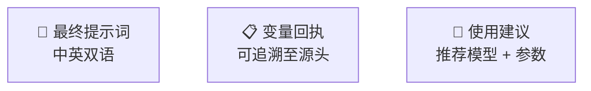
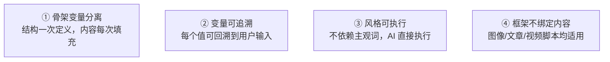

# 通用提示词框架 · 架构总览

> 不绑定 平台 · 品类 · 风格 · 模型 —— 元框架

## 核心公式



## 五阶段流水线



### 阶段 0 · 确定骨架



### 阶段 1 · 变量填充

```mermaid
graph LR
    subgraph 核心变量 · 用户确认
        C1[内容主体]
        C2[风格调性]
        C3[关键约束]
        C4[文字文案]
    end
    subgraph 衍生变量 · Claude 推导
        D1[尺寸比例]
        D2[构图视角]
        D3[色彩色调]
        D4[边缘细节]
    end
```

### 阶段 2 · 风格锚点拆解





> 三条铁律：≤ 30 字/条 · 零抽象形容词 · AI 可直接执行

### 阶段 3 · 输出



### 阶段 4 · 自检


## 参考文件


## 设计原则



## 抽象词 → 具体指令

| 抽象词 | 具体指令 |
|---|---|
| 高级感 | 单色 / 大面积留白 / 单一光源 / 材质高光可见 |
| 冲击力 | 超广角 / 高对比度 / 主体占 70%+ / 动感模糊 |
| 日系 | 色温 5000K+ / 高光偏青 / 略微过曝 / 浅景深 |
| 复古 | 暗角 / 胶片颗粒 / 高光偏黄 |
| 科技感 | 冷色调 / 金属材质 / 边缘光 / 无衬线几何字体 |
| 温暖 | 色温 3000-4500K / 侧逆光 / 柔焦 |
| 干净 | 单色背景 / 无多余元素 / 光影柔和 |
| 接地气 | 正面平视 / 自然光 / 生活痕迹 |
